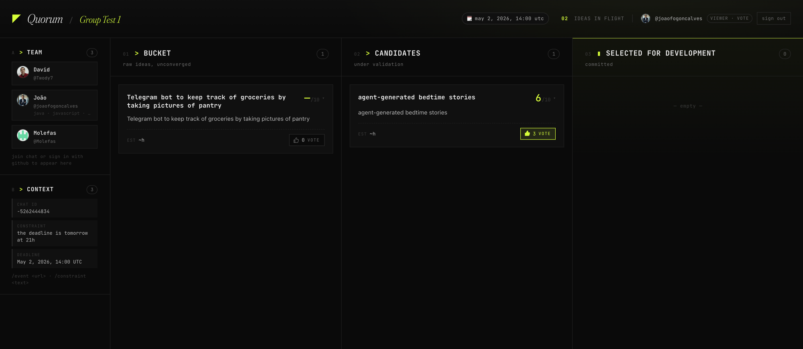

<p align="center">
  
</p>

<h1 align="center">Quorum</h1>

<p align="center">
  <em>A chat-native agent that helps your team converge on <strong>what to build</strong>.</em>
</p>

<p align="center">
  
  
  
  
  
</p>

<p align="center">
  <a href="https://quorum.joao-f-o-goncalves.workers.dev"><strong>→ Try the live board</strong></a>
</p>

---

<p align="center">
  
</p>

AI made software cheap to ship. Picking the wrong thing is now the expensive mistake. **Quorum** lives in your team's group chat (Telegram now, Slack-adapter-ready), runs ideas through three phases — **Ideation → Validation → Planning** — with backflow when constraints change, and grounds its scoring in your team's real skills.

Built end-to-end on Cloudflare for **Agents Day 2026**.

## Highlights

- **Two independent ranking signals** — `votes` (social) and `fit_score` (agent validation). The board shows both; neither dominates.
- **Backflow is the demo moment.** `/constraint we lost a backend dev` re-runs validation across `parked` and `killed` ideas and reanimates the ones that suddenly fit again.
- **Agentic-first, commands as fallback.** Plain language gets routed (`"flesh out the long description of #3 with a paragraph about session persistence"`) — slash commands stay as the deterministic safety net.
- **Per-chat Durable Object** — one `QuorumAgent` instance per Telegram chat, each with its own SQLite, scheduling, and grammY bot inside `Agent.onRequest`.
- **Deadline nudges** via `Agent.schedule()` at T-72h / T-24h / T-0.
- **GitHub OAuth** for per-user vote and an editor whitelist on `PATCH` endpoints.
- **One Worker, one URL.** Telegram webhook, board UI (Vite + React via Static Assets), and JSON API all share the same Worker and the same per-chat DO.

## Architecture

```
                   ┌──────────────────────────────────────┐
   Telegram ──────►│  POST /webhook                       │
   /idea ...       │  (signature-checked, forwarded to    │
                   │   QuorumAgent[chatId]/onUpdate)      │
                   │                                      │
   Browser ──────► │  GET  /                              │
   web/ UI         │  (Static Assets — web/dist)          │
                   │                                      │
   Browser ──────► │  GET  /api/board?chat=<id>           │
   fetch           │  PATCH /api/ideas/:uid?chat=<id>     │
                   │  (forwarded to QuorumAgent[chatId])  │
                   │                                      │
                   └──────────────┬───────────────────────┘
                                  │
                       ┌──────────▼──────────┐
                       │  QuorumAgent (DO)   │
                       │  per Telegram chat  │
                       │  • this.sql (SQLite)│
                       │  • grammY bot       │
                       │  • Workers AI calls │
                       └─────────────────────┘
```

## Stack

- **Cloudflare Workers** + **Agents SDK** — `Agent` extends Durable Object with built-in SQLite, state, scheduling
- **Workers AI** — Llama 3.3 70B fp8-fast (default), Llama 3.1 8B fast (automatic fallback under load)
- **Static Assets** — the `web/` (Vite + React) board ships in the same Worker via `assets.directory`
- **Telegram Bot API** via grammY, inside `Agent.onRequest`
- **Escape hatch** — Gemini 2.5 Flash via Cloudflare AI Gateway if validation quality slips. No Anthropic in the stack.

## Demo flow

```
You    /idea session-replay for prod incidents
Bot    Idea #4 added — "session-replay for prod incidents"

You    /vote 4
Bot    Voted. Total: 3

You    /validate 4
Bot    #4 score: 7/10 — strong frontend skills on the team, deadline tight
       but feasible, no obvious blockers.

You    /constraint we lost a backend dev
Bot    Reanimated: [#2, #6]. Demoted: [#1, #4].
       Reason: backend depth dropped — frontend-heavy ideas now favoured.

You    /why 2
Bot    #2 — "share-link previews for chat threads"
       Score: 8/10. Fit shifted from 5 → 8 after constraint update.
       History: ideating (Apr 30) → parked (Apr 30) → ideating (May 1).
```

That `/constraint` step is the pitch. *Same agent, same code, audit trail intact.*

## Commands

Core (never cut):

| Command | What it does |
|---|---|
| `/idea <text>` | Add a new idea, status `ideating` |
| `/vote <id>` | Toggle your vote on an idea (idempotent) |
| `/ideas [phase]` | List ideas, optionally filtered by phase |
| `/constraint <text>` | Set a constraint, re-validate parked + killed, reshuffle the rank |
| `/why <id>` | Show scoring reasoning + full audit trail |
| `/me <text>` | Self-declare your skills |
| `/team` | Aggregate team skills + gaps |

Validation & planning:

| Command | What it does |
|---|---|
| `/validate <id>` | Rescore one idea against current team + context |
| `/promote <id>` | Move to the next phase |
| `/park <id>` | Park (eligible for backflow) |
| `/kill <id>` | Kill (still queryable, still eligible for backflow) |
| `/rank` | Top 3 in the active phase |
| `/plan <id>` | LLM-generated milestones, risks, owners |

Context & metadata:

| Command | What it does |
|---|---|
| `/event <url>` | Scrape an event page, populate context (deadline, budget) |
| `/deadline [when]` | Set or show the team's shipping deadline (absolute or relative) |
| `/name [text]` | Set or show this board's name |
| `/brief <id> <text>` | One-line description shown on the card |
| `/long <id> <text>` | Long description shown in the editor modal |
| `/gh <username>` | Pull skills from a GitHub profile |
| `/forget` | Wipe your skills row |

All of these are also reachable via plain language — the router in `quorum/src/router.ts` dispatches to the same agent methods. Slash commands are muscle-memory + deterministic fallback.

## Repo layout

| Path | What's there |
|---|---|
| `quorum/` | The Worker — Agent, router, Telegram bot, HTTP API |
| `web/` | React + Vite board UI (built into the Worker via static assets) |
| `team/` | Per-person scope and status |
| `docs/` | Specs and design notes |
| `PLAN.md` | Pitch, stack rationale, day-of timeline, cuts-in-order, demo flow |
| `SPEC.md` | **Source of truth** for SQL schema, commands, HTTP endpoints, prompt I/O, scoring |
| `CLAUDE.md` | Orientation for Claude Code sessions on this repo |
| `NEXT_STEPS.md` | Deferred work, known issues, ideas captured during the build |

Read `PLAN.md` for the why, `SPEC.md` for the contracts, `CLAUDE.md` for the working agreements.

## Run it

First-time setup is in [`quorum/SETUP.md`](./quorum/SETUP.md). Day-to-day:

```bash
cd quorum
npm install
npm run dev      # local Worker + DO
npm run deploy   # rebuilds web/ then wrangler deploy
npm run tail     # live logs
```

`npm run deploy` runs a `predeploy` hook that builds `web/` first — don't call `wrangler deploy` directly or you'll ship stale UI assets.

## Team

Built in 9 hours by:

- **João Gonçalves** — lead architect, Agent class, Telegram, backflow, pitch · [`team/joao.md`](./team/joao.md)
- **Rui (Molefas)** — UX, board UI, message rendering, demo capture · [`team/rui.md`](./team/rui.md)
- **Twody7** — Workers AI prompts, GitHub skills, dogfooding · [`team/twody7.md`](./team/twody7.md)

## Sponsor

**Cloudflare** — *"Build a Personal Agent that Automates a Meaningful Task."* Single-target. Every architectural primitive earns its place on the Cloudflare platform.

---

> "AI didn't replace the team — it made the team's taste matter more."
